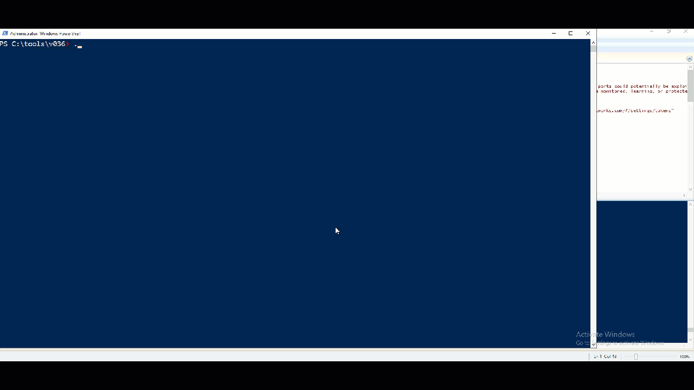

## Zero Networks POC Trust Meter - Scan Managed Assets Script
```POC_TrustMeter_ScanManagedAssets.ps1```



The purpose of this script is to perform a network port scan on assets managed by Zero Networks.

   These exposed ports could potentially be exploited/compromised by an attacker depending on the type of vulnerability. 
   Its important to iteratively close these open ports unless its expected behavior. 

   This script was created mainly with the intent of reviewing open ports on assets targeted for the POC before/after assets are protected.

   Steps are:
   - Conduct a scan on assets either in monitoring, learning state. (Save this report for comparison)
   - Set same assets to protection.
   - Perform the same scan against these protected assets.
   - Compare exposed ports before/after being protected by Zero Networks.✅


### Note
- For any protected assets, you may have to exclude the asset performing the scan from JIT MFA policies in order not to trigger multiple MFA prompts. 
- It is suggested to create a scanner group and then exclude any assets that will perform scans from JIT MFA policies. 


### Running the script
   You can run the script with no arguments and it will prompt you with the required parameters it needs. 
   ```
   .\POC_TrustMeter_ScanManagedAssets.ps1
   ```

   You can also run this script with arguments if you wish to perform this scan in one-line without having input any required parameters. 

   Performs a deep scan on assets in learning and protected
   ```
   .\POC_TrustMeter_ScanManagedAssets.ps1 -apiToken <Api Token created in portal> -mode deep -assetGroups "learning,protected" 
   ```
